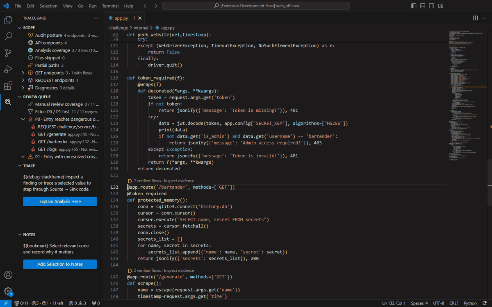
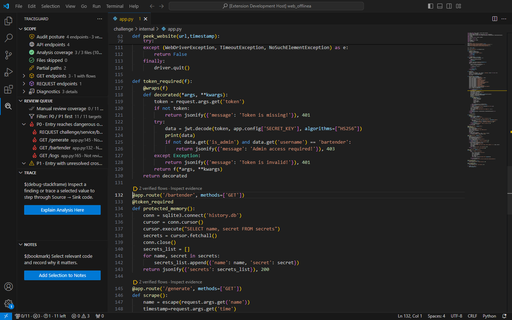
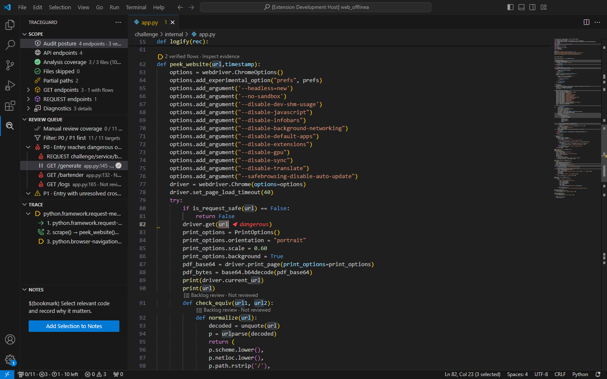
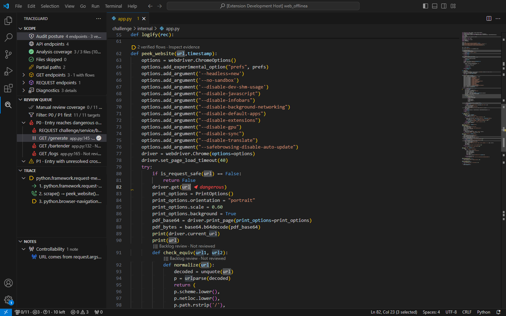

# TraceGuard White-box Audit

[简体中文](README.zh-CN.md)

TraceGuard is a VS Code extension for white-box code review. It maps application entry points, helps decide what to read first, follows values across functions, and keeps review decisions next to the code instead of burying them in another document.

It does not decide whether a vulnerability exists. Whether input is externally controllable, whether the controls are sufficient, and whether a path is actually exploitable still require a reviewer who understands the application. The extension puts the evidence in front of you.

> The GIF and screenshots below are actual output from TraceGuard reviewing the current Hack The Box Python/PHP challenge source. They are not interface mockups.



## The basic workflow

Start with **Scope** and check that the entry points and index coverage look complete.

Then open **Review Queue**. It decides what to read first from entry reachability, sensitive operations, and places where analysis stopped.

Once you are in the code, use **Trace** to inspect callers, callees, control conditions, and the final Sink reached by the selected value.

Finish in **Notes**, where you can record controllability, missing context, exploit conditions, and the final review decision.

### Scope and Review Queue

Scope lists the number of entry points, files that were actually indexed, skipped files, and paths cut short by analysis budgets. Review Queue separates P0, P1, P2, and Backlog targets. Selecting one opens the corresponding function and marks it In review.



### Source → Sink Trace

For this project, the URL parameter on `/generate` produces this three-step path:

```text
request.args.get('url')
  → scrape() calls peek_website(url, timestamp)
  → driver.get(url)
```

The Trace view shows the proof status and source location of every step. Moving between steps jumps directly to the Source, the cross-function call, or the final Sink.



### Notes

Selected code can be recorded as Controllability, Missing Context, Exploit Condition, False Positive Reason, and other evidence types. The screenshot records the controllability decision for `driver.get(url)`. Each note keeps its file and line so one click returns to the evidence.



## Features

Maps HTTP, Controller, and framework entry points by request method and route to outline the attack surface.

Orders the review queue as P0, P1, P2, and Backlog. These are reading priorities, not vulnerability severity ratings.

Shows Source-to-Sink paths with the source, assignments, calls, returns, control conditions, and final sensitive operation.

Provides Trace Origin, Trace Uses, Callers, Callees, Trace to Entry, and Reachable Sinks queries.

Labels every analysis step as `verified`, `syntax-only`, `heuristic`, or `unresolved`. Uncertain evidence stays uncertain instead of being presented as verified.

Reports gaps in coverage, including skipped files, partial indexes, truncated paths, and calls that could not be resolved. An empty result is not presented as proof that the code is clean.

Keeps reviewer decisions such as Reviewed, False Positive, Accepted Risk, Suppressed, and Needs Context separate from automatic analysis results.

Stores selected code as notes for controllability, exploit conditions, missing context, or remediation.

Lets each project define its own Sources, Sinks, Sanitizers, Propagators, rule controls, and excluded paths in `.traceguard.json`.

Runs locally. Source code stays in VS Code, and the extension does not execute the reviewed project.

## Understanding the results

**Verified Flow**: the Source-to-Sink connection has fairly complete evidence, but exploitability is still the reviewer's decision.

**Review Hypothesis**: the path is worth reading, but some calls, type decisions, or value propagation steps are not fully proven.

**Dismissed / Resolved**: a reviewer has already recorded a conclusion for the path.

P0, P1, P2, and Backlog only control reading order. They are not severity ratings. By default, only Verified Flows appear in the VS Code Problems panel.

## Language support

Java has the broadest coverage: Spring MVC, JAX-RS, Servlet, package/import relationships, interface implementations, JDBC/JPA/MyBatis, filesystem operations, deserialization, command execution, and HTTP calls.

PHP covers Laravel, Symfony, Composer PSR-4 autoloading, PDO/MySQLi, DB/Eloquent raw queries, filesystem operations, deserialization, cURL/Guzzle, and command execution.

Python covers FastAPI, Flask, Django, Pydantic field validation, DB-API/SQLAlchemy, filesystem operations, pickle/YAML, subprocess, and HTTP clients.

JavaScript/TypeScript retains full AST analysis, project-level imports, closures, and callbacks.

C# and Go currently cover framework entries, call relationships, and local data flow. Their support is narrower than the languages above.

Java, PHP, and Python parser assets are built in for offline backend review. Other language assets are installed on first use and can also be served from a private mirror.

## Install

Download `traceguard-vscode-1.0.0.vsix` from [Releases](https://github.com/xingguangqwq/traceguard-vscode/releases/latest), then run **Extensions: Install from VSIX** in VS Code.

```powershell
code --install-extension .\traceguard-vscode-1.0.0.vsix
```

Open a source folder you trust. Do not use the extension as a reason to execute unknown code.

## Start reviewing

Open the sidebar and select **Build Review Queue**. Check **Scope** first and make sure the index is complete, otherwise the queue may have gaps.

Pick a target from **Review Queue**. Select code and use the editor's **TraceGuard >** menu to explain it or trace a value. Once Trace is expanded, select any step to jump to the corresponding code.

Save important code in **Notes** and record the review decision while the reasoning is still fresh.

## Project-specific rules

Run **TraceGuard: Open Project Audit Configuration** to create `.traceguard.json` in the project root:

```json
{
  "version": 1,
  "sources": [
    {
      "language": "php",
      "function": "tenantInput",
      "returnsTaint": true
    }
  ],
  "sinks": [
    {
      "language": "php",
      "function": "internalExec",
      "arguments": [0],
      "kind": "COMMAND_EXEC"
    }
  ],
  "excludePaths": ["vendor/**", "generated/**"]
}
```

Each workspace root keeps its own configuration. Invalid edits are reported without replacing the last configuration that worked.

## Before you use it

TraceGuard performs bounded local static analysis. Large files or deep paths may be reported as partial results or skipped. Dynamic dispatch, reflection, generated code, and missing dependencies can also interrupt a trace.

So **no result does not mean the code is safe**. Keep that in mind while reviewing.

See [CHANGELOG.md](CHANGELOG.md) for version changes.

[Report an issue](https://github.com/xingguangqwq/traceguard-vscode/issues) · MIT License
