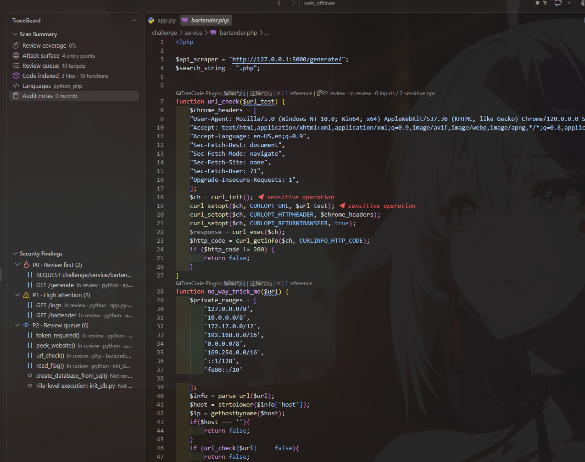

# TraceGuard 本地 SAST

[English](README.md)

TraceGuard 是一个本地、增量、可解释的 VS Code 轻量 SAST。它会整理审计队列、追踪候选 Source → Sink 路径，并把人工判断保存在代码旁边。

它不会直接告诉你“这里一定有漏洞”。代码怎么走、限制是否有效，仍然需要你自己判断。



## 三分钟上手

1. 从 [Releases](https://github.com/xingguangqwq/traceguard-vscode/releases/latest) 下载 VSIX。也可以在本地运行 `npm run package` 构建 0.7。
2. 在 VS Code 中运行 **Extensions: Install from VSIX**，选择刚下载的文件。
3. 打开一个受信任的源码目录。
4. 点击活动栏里的 TraceGuard 代码路径图标。
5. 点击 **Build Review Queue**，从第一个 P0 或 P1 目标开始看。

也可以在 PowerShell 中安装：

```powershell
code --install-extension .\traceguard-vscode-0.7.3.vsix
```

## P0、P1、P2 怎么看

这些等级只是阅读顺序，不是漏洞等级：

- **P0 — Review first：** 同时出现入口、外部输入、敏感操作等强线索，建议先看。
- **P1 — High attention：** 有比较明显的安全相关代码，适合接着检查。
- **P2 — Review queue：** 其余值得阅读的函数。

打开一个目标后，可以按这个顺序检查：

1. 找入口：路由、Controller、Handler、命令入口或文件级执行代码。
2. 找输入：请求参数、Header、Cookie、消息内容、文件名等。
3. 追变量：看它经过了哪些赋值、条件和转换。
4. 找敏感操作：数据库、命令执行、文件、网络请求、反序列化等。
5. 看防护：输入校验、编码、身份认证和权限判断是否真的覆盖了这条路径。
6. 记下结论，把目标标记为已检查，再看下一个。

## 一个简单例子

```php
function read_file() {
    $name = $_GET['name'];
    return file_get_contents('/uploads/' . $name);
}
```

第一次看这段代码，不用急着套漏洞名称，先问四个问题：

- `$_GET['name']` 是不是外部可控？
- 它有没有进入文件读取操作？
- 拼接后的路径有没有规范化，并限制在指定目录？
- `../` 或绝对路径能不能改变最终读取的文件？

TraceGuard 可以帮你标出输入和文件操作，但是否真的能够利用，还要结合调用位置和周围代码确认。

## 阅读代码时常用的功能

- **Trace Backward：** 解释当前变量或属性路径从哪里来。
- **Trace Forward：** 解释当前值经过哪些赋值、调用、返回以及敏感操作。
- **Find Callers / Find Callees：** 查询当前函数周围的项目调用图。
- **Trace to Entry Point：** 反向追到 HTTP、CLI 或框架入口。
- **Show Reachable Sinks：** 列出当前函数可以到达的危险操作。
- **Explain Analysis Here：** 展示前端能力、语义事实，以及数据流为什么在某一步中断。
- **Show Security Clues Here：** 查看当前函数里有哪些审计线索。
- **Add Selection to Audit Notes：** 保存一段关键代码并写下原因。
- **Mark Current Target Reviewed：** 标记当前目标已经检查。
- **Export Audit Notes：** 导出 Markdown 审计记录。
- **Export Findings as SARIF：** 导出稳定指纹和完整 Source → Sink 路径，供 CI 或安全平台使用。
- **Copy Analysis Path as Markdown / Export Analysis Debug JSON：** 将查询结果带着启发式和未解析标记导出，方便复核。

Finding 决策与审计覆盖率分开保存。候选结果可以标记为已审阅、误报、接受风险或抑制，不会因为代码上下移动而丢失 sink 身份。

## 为什么这两步能够连起来

TraceGuard 0.7.3 使用规范化 Access Path 追踪 `request.body.command`、`options.url`、`items[0]` 这样的字段和元素，而不是把整个对象都当成同一个污染值。别名赋值会重映射子字段，精确覆盖会清除旧污点；带类型信息的 `Map` 和数组操作会说明读写的是哪个元素，因此同一对象中的无关 sibling 字段不会被一起污染。

闭包捕获的外部变量通过显式调用边传播。TypeScript 会用 receiver 类型区分同名类方法；接口分派只保留有界实现候选，如果仍有多个实现，则明确标成需要复核。

界面中的每条传播边都会记录连接依据，并标注 `verified`、`syntax-only`、`heuristic` 或 `unresolved`。启发式连接会降低置信度；无法解析的边会说明数据流为什么中断，不会伪装成确定的 Source → Sink 路径。

使用跨文件追踪时，点击待审计函数上方的入口，先选择一条可能的路径，再选择任意步骤跳到对应代码行。`No control seen` 表示路径上暂未识别到校验或鉴权线索；`Check call target` 表示存在同名调用，需要人工确认目标函数。

大型项目可以在 VS Code 设置中调整 `traceguard.flowMaxDepth`、`traceguard.flowMaxPaths`、`traceguard.queryMaxNodes`、`traceguard.maxWorkspaceFiles` 和 `traceguard.showFlowCodeLens`。查询达到节点上限时会明确显示为 truncated。默认需要从侧边栏显式启动全工作区索引；只有在能够接受启动开销时才建议启用 `traceguard.indexOnStartup`。未保存内容的实时索引也需要通过 `traceguard.liveIndex` 主动开启，文件保存后仍会自动刷新。

## 项目自定义审计语义

运行 **TraceGuard: Open Project Audit Configuration** 可以创建 `.traceguard.json`。它用于描述项目自己的 Source、Sink、Sanitizer/Guard、Propagator/Wrapper、规则开关和排除路径：

```json
{
  "version": 1,
  "sources": [
    { "language": "typescript", "module": "./request", "function": "getUserInput" }
  ],
  "sinks": [
    { "language": "typescript", "module": "./process", "function": "internalExec", "arguments": [0], "kind": "COMMAND_EXEC" }
  ],
  "sanitizers": [
    { "language": "typescript", "module": "./security", "function": "escapeCommand", "arguments": [0], "capability": "SHELL_ESCAPE" }
  ],
  "propagators": [
    { "language": "typescript", "function": "wrapValue", "arguments": [0], "returnsTaint": true }
  ],
  "rules": {
    "potential-open-redirect": false,
    "potential-command-injection": { "severity": "high" }
  },
  "excludePaths": ["generated/**", "**/*.fixture.ts"]
}
```

安全相关模型尽量填写 `module`、`qualifiedName` 或 `receiverType`。只写函数名时，结果会明确降为 `syntax-only`：它可以帮助发现候选，但不能成为高置信 Sanitizer，也不能静默消除 Finding。配置写错时会在 Problems 中报错，同时继续使用上一次有效配置。

## 支持语言

- **Tier A — Java / PHP / Python：** 后端代码审计的持续重点。Java 0.8 已补 AST 原生 Spring/JAX-RS/Servlet 入口、DTO Access Path、接口到实现类分派、重载选择、MyBatis/JDBC/JPA 与 Spring HTTP 语义；PHP、Python 保持现有 AST/数据流能力，并按后续版本逐门加深项目级语义。
- **Tier B — JavaScript / TypeScript / JSX / TSX：** 保留现有 Tree-sitter、持久项目级 TypeScript Program、import/type 解析、CFG/def-use、框架绑定和跨函数传播；后续以修回归为主，不主动扩张功能面。
- **Tier C — C# / Go：** 维持 AST 函数/回调、框架入口、赋值、调用、参数和返回传播；解析不完整时明确降低置信度，只修正确性问题，不主动扩张语义库。

Pattern 匹配只保留为解析失败时的降级方案和框架/安全语义分类器。生成代码、反射、动态分派和项目自定义封装仍可能需要人工发现。侧边栏会展示 AST 覆盖率、容错解析原因和跳过文件，不会把部分扫描伪装成完整扫描。

## 隐私和边界

- 不上传源代码。
- 不执行被审计项目。
- 不依赖 Python 或 Web 服务。
- 出现行内提示，只代表这里值得检查，不代表已经确认漏洞。
- 队列全部看完，也不代表项目一定安全。
- 大于 2 MB 的文件会被跳过。全量索引默认最多处理 1,000 个受支持文件；确认目标项目内存可接受后可调高到 8,000。任何限制影响覆盖范围时都会明确标为“不完整”，不完整扫描不会把历史 review 状态当成孤儿清理。
- 当 Source-to-Sink 候选超过展示上限时，TraceGuard 会优先保留高影响路径，并将结果标记为“已排序的子集”。

导出的审计会话可能包含你主动保存的代码片段，分享或提交前记得检查。

## 开发

分析流程只保留一个从语言细节进入公共分析层的边界：

```text
源代码 → 语言 Frontend → traceguard-ir → 数据流引擎 → 规则 / 审计视图
```

语言语法和操作提取位于 `src/frontends/`。七种 Tree-sitter WASM grammar 输出同一份版本化 IR，JavaScript/TypeScript 在分析 Worker 内共享增量重建的 TypeScript Program；Pattern Frontend 只作为降级回退和差分检查。CFG、调用解析、传播事实、函数摘要、Access Path 与 Finding/Query 路径遍历位于 `src/dataflow/`，增量数据流和规则在持久 Worker 中计算。公共 CFG 已覆盖条件求值、分支汇合、循环回边、break/continue、结构化异常边、throw 和早返回可达性。

审计目标和 Finding 使用基于语义符号与 sink 的稳定 ID，不依赖行号。`src/analysis/incremental-cache.js` 与 `src/dataflow/function-summary.js` 已进入运行主链路并执行依赖范围失效。五个核心规则族是命令注入、SQL 注入、路径穿越、SSRF 和不安全反序列化，每条规则只接受自己的 sanitizer/guard 能力。

```powershell
npm install
npm test
npm run check
npm run benchmark -- --files=1000 --max-rss-mib=512
npm run benchmark -- --fixture=typescript-dependents --files=100 --max-incremental-ms=500 --max-rss-mib=512
npm run test:extension-host
npm run package
npm run verify:package
```

CI 还会在最低支持的 VS Code 版本上执行 `npm run test:extension-host` 激活冒烟测试。交互测试时，使用 VS Code 打开插件目录并按 `F5`。

[提交问题](https://github.com/xingguangqwq/traceguard-vscode/issues) · [参与开发](CONTRIBUTING.md) · MIT License
